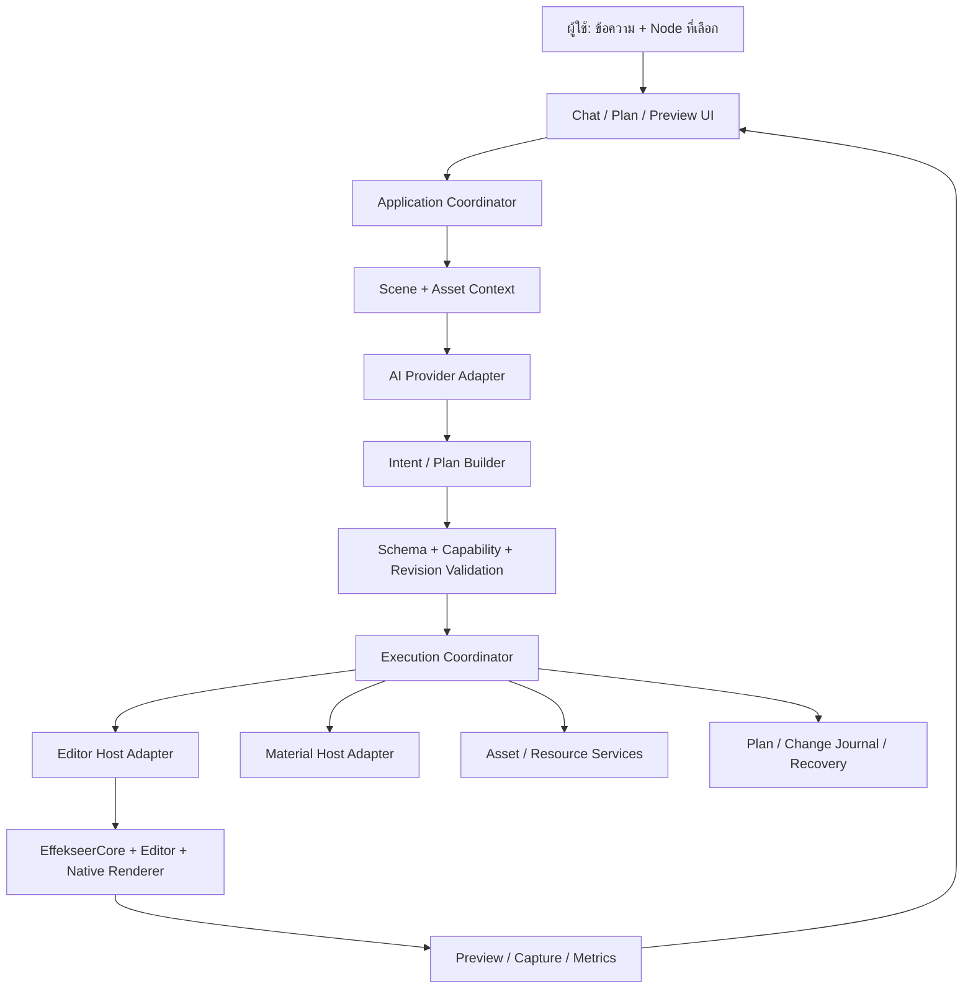

# Architecture draft: AI สำหรับสร้างและแก้ Effekseer Effect

วันที่: 8 ตุลาคม 2026 · สถานะ: เริ่ม implementation ของ isolated file host สำหรับ 1.80.7 และ 1.70e

เอกสารนี้กำหนด architecture สำหรับเพิ่ม AI ที่สร้าง Effect ใหม่ แก้ Node ที่เลือก และปรับภาพผ่าน Preview โดยใช้โครงสร้างและตัวบันทึกของ Effekseer Editor ร่วมกับระบบจัดการ Asset ที่มีอยู่ ตอนนี้มี isolated file host ที่สร้าง/อ่าน Node แก้สี/ขนาด Fixed และบันทึกผ่าน Core จริงแล้ว ดู [วิธีใช้และข้อจำกัด](editor-host.md) ส่วน AI, bridge ในหน้าต่าง Editor และ Preview ยังไม่ได้พัฒนา ชื่อ operation/interface/protocol ในร่างด้านล่างเป็นทิศทางระยะยาว ให้ยึดคู่มือ host เป็นสัญญาของ implementation ปัจจุบัน

คำว่า “เผื่อรองรับทุกอย่าง” หมายถึงมีจุดต่อขยายสำหรับทุกกลุ่มงานและฟอร์แมต โดยประกาศความสามารถตาม adapter ที่ผ่านการทดสอบจริง ฟีเจอร์ที่ยังไม่มี adapter จะตอบว่าไม่รองรับ แทนการรับคำสั่งแล้วแก้ไฟล์แบบคาดเดา

## 1. เป้าหมายและตัวอย่างงาน

| งานของผู้ใช้ | ผลลัพธ์ที่ระบบควรทำ |
|---|---|
| เปลี่ยนสี Node นี้เป็นม่วง | รู้ Node ที่เลือก ชนิด renderer และวิธีเก็บสี แล้วแก้เฉพาะขอบเขตที่สั่ง |
| ลดขนาดครึ่งหนึ่ง | คูณค่าขนาดที่เกี่ยวข้องกับโหมดปัจจุบัน โดยอธิบายผลต่อ Node ลูก |
| หมุนเป็นพายุ | สร้าง/แก้แรงหมุน แรงยก ตำแหน่งเกิด และอายุของอนุภาค |
| กระจายออก | ตั้งทิศความเร็วหรือแรงผลักออกจากศูนย์กลาง พร้อมจำนวนและเวลาปล่อย |
| พุ่งไปข้างหน้า มีหาง | สร้างหัวที่เคลื่อนที่และ Node Ribbon/Track ที่ทิ้งรอยตามทาง |
| สร้างใหม่จากคำบรรยาย | เลือกสูตรสร้างที่รองรับ ประกอบ Node ตั้งค่า และผูก Asset |
| เปลี่ยนให้คล้าย Effect ตัวอย่าง | อ่านโครงสร้างตัวอย่างเป็นข้อมูล แล้วสร้างแผนแก้เป้าหมาย |
| แก้หลาย Effect | เตรียมแผนรายไฟล์ แสดงกรณีผิดพลาด และบันทึกเป็นงานแยกกัน |
| สร้างชุดพร้อมย้าย | ใช้ระบบค้น/Map/จัดชุด Asset เดิมและตรวจผลหลังบันทึก |
| ปรับให้เบาลง | วัดค่าที่อ่านได้และผล Preview เสนอปรับจำนวน อายุ และความละเอียดตามเกณฑ์ |

ระบบต้องแยก “แก้โครงสร้างได้ถูกต้อง”, “เปิดและแสดงผลได้” และ “ภาพตรงใจผู้ใช้” ออกจากกัน การเปิดไฟล์ผ่านและไม่มี path หายยังไม่ใช่หลักฐานว่าภาพเหมือนเดิมหรือได้ภาพตามคำบรรยาย

## 2. ฐานที่มีอยู่และสิ่งที่จะเพิ่ม

### 2.1 ใช้ระบบปัจจุบันต่อได้

- `ResourceScanner` / `PortabilityValidator`: อ่าน dependency และตรวจ path ภายในขอบเขตที่รองรับ
- `ResourceMappingService`: ค้น Asset ตามชื่อและชนิด เตรียมแผน และ Map แบบใช้คลังเดิมหรือสร้างชุดใหม่
- `DiscoverBatchAsync`: ค้น Effect ในโฟลเดอร์และโฟลเดอร์ย่อย
- `AssetLibraryStore`: บันทึกชื่อและตำแหน่งคลัง Asset ในเครื่อง
- CLI Inspector / `repair`: ตรวจไฟล์ เตรียมการซ่อม และบันทึกในโหมดที่รองรับ
- WPF หน้าเดียว: เลือกไฟล์/โฟลเดอร์ จัดการกรณีชื่อซ้ำ ดูตัวอย่างการ Map และอ่านผลตรวจ
- ตัวเขียนปัจจุบัน: แก้ resource path ใน layout ที่ตรวจแล้ว พร้อม backup/hash/staging ตามโหมด

การทดสอบเดิม 98 รายการเป็นหลักฐานของระบบนี้ ไม่ใช่หลักฐานว่า Editor Bridge สร้างหรือแก้ Node ได้แล้ว

### 2.2 ต้องพัฒนาเพิ่ม

- Editor Host Adapter ที่เข้าถึง project และ selection จริง
- Scene snapshot และรหัส Node สำหรับ session
- Parameter schema และ semantic binding ที่รู้ชนิดค่า/โหมด/เวอร์ชัน
- ชุด operation สำหรับอ่าน แก้ สร้าง จัดลำดับ และลบ Node
- Plan validator / execution coordinator / conflict detection
- Preview capture และการตรวจ load → edit → save → reload
- AI provider abstraction และตัวแปลความต้องการเป็นแผน
- Preset/recipe สำหรับสร้างรูปแบบเอฟเฟกต์ที่ทดสอบแล้ว
- Adapter แยกสำหรับ Material graph, model conversion และการสร้าง Asset
- UI สำหรับแชต รายการเปลี่ยนแปลง ประวัติงาน และผล Preview

## 3. สิ่งที่ตรวจพบจาก upstream

ตรวจ source revision `82b37081a302b9f9eff0bf14dc6c845fca8c3c54` ของ Effekseer เมื่อจัดทำเอกสาร ดูลิงก์ในข้อ 29

| หลักฐาน | ใช้กำหนด architecture อย่างไร | ข้อจำกัด |
|---|---|---|
| `Core` มี Root, SelectedNode, New และ SaveTo | Host adapter อ่าน project/selection และใช้ตัวบันทึกจริง | ไม่ใช่ remote API สำเร็จรูป |
| `NodeBase` มี AddChild, RemoveChild, InsertParent | สร้างและเปลี่ยนโครงสร้างต้นไม้ผ่าน object model | ต้องตรวจ parent, cycle และผลของ inheritance |
| `Node` มี LocationValues, RotationValues, ScalingValues, DrawingValues ฯลฯ | แบ่ง parameter เป็น component ตามหน้าที่ | property หลายตัวเป็น value object ไม่ใช่ setter ของ primitive |
| Renderer มี Fixed/Random/Easing/F-Curve/Gradient และข้อมูล Ribbon/Track | ต้องระบุ mode และ renderer ก่อนแก้สี/รูปร่าง | ใช้ property path เดียวกับทุก renderer ไม่ได้ |
| `CommandManager` มี Undo/Redo และ StartCollection/EndCollection | รวมการแก้เป็นหนึ่งรายการ Undo เมื่อ adapter พิสูจน์แล้ว | collection ไม่ใช่ transaction ของไฟล์หรือ GPU |
| Source มี SelectedScript / CommandScript และ compiler ภายใต้ `SCRIPT_ENABLED` | ทดลอง script เป็นช่องทาง prototype ได้ | ต้องตรวจว่า build ที่ผู้ใช้ติดตั้งเปิดใช้และรันได้จริง |
| `EfkEfc` ใช้ exporter และสร้างข้อมูล EDIT/INFO/BIN_ | แก้ Node แล้วต้องบันทึกผ่าน exporter ของรุ่นที่เลือก | อาจ normalize หรือเปลี่ยน format/version/compatibility data |
| `EffekseerCore.csproj` ใน revision นี้มี runtime/dependency ของตัวเอง | แยก host process/build profile ออกจาก WPF .NET 10 | ยังไม่ได้พิสูจน์ว่าใส่ DLL เดียวแล้วใช้ได้กับทุกเครื่อง |
| Material graph อยู่ในฝั่ง EffekseerMaterial | ทำ MaterialHostAdapter แยก | ใช้ Core ของ Effect เป็นตัวแก้ graph ทั้งหมดไม่ได้โดยอัตโนมัติ |

## 4. ภาพรวมระบบ



AI แนะนำแผนผ่าน operation ที่กำหนดไว้ ตัวดำเนินงานจริงตรวจ parameter และแก้ object ของ Editor ส่วน Path Extractor ดูแล resource path และชุด Asset ใช้ข้อตกลงเดียวกันกับ UI/CLI/MCP ในอนาคต

## 5. ทางเลือกการเชื่อมกับ Editor

### 5.1 ทางหลัก: เพิ่ม Bridge ใน source ของ Editor

เริ่มจาก checkout/fork ของ Effekseer รุ่นที่กำหนด เพิ่ม module C# สำหรับอ่าน state และเรียก operation บน thread ของ Editor ให้ได้ก่อน มี panel เรียบง่ายสำหรับทดสอบโดยไม่ต้องมี AI

ข้อได้เปรียบคือรู้ selection ที่ผู้ใช้เลือกจริง ใช้ Preview เดิม และสามารถเชื่อมประวัติ Undo กับ Editor ได้ ไม่ต้องสร้าง renderer ใหม่ใน Path Extractor

ยังต้องพิสูจน์การ build, startup, thread dispatch, refresh Preview และ native dependencies ไม่มีข้อสรุปว่าเป็น plugin แบบวางไฟล์แล้วใช้ได้กับ Effekseer ทุก release

### 5.2 ทาง prototype: script ที่รับ Node ที่เลือก

ตรวจ external script/SelectedScript ของ build ที่ใช้ ถ้ารันได้ ใช้ทดลองอ่านค่า เปลี่ยนสี/ขนาด และ Undo เพื่อพิสูจน์ binding หลีกเลี่ยงการผูก protocol หลักกับ IronPython/C# script เพราะความพร้อมของ runtime ต่างกันได้

### 5.3 ทางเสริม: host สำหรับทำงานกับไฟล์โดยไม่มี Editor UI

สร้าง process ที่โหลด official core/exporter และ dependency ของ profile นั้น เหมาะกับงาน batch และ save/reload test การ render headless เป็น capability แยก ซึ่งอาจต้องใช้ native/GPU/window initialization

การแก้ไฟล์จากภายนอกไม่แก้ state ที่เปิดอยู่ใน Editor โดยอัตโนมัติ ต้องให้ผู้ใช้ reload หรือมี bridge ประสาน ownership ของ project หลีกเลี่ยงสอง process บันทึกไฟล์เดียวกันพร้อมกัน

### 5.4 การแบ่งงานใน repository

| ตำแหน่ง | หน้าที่ |
|---|---|
| Repository Path Extractor นี้ | protocol/contracts, application coordinator, AI adapters, Asset integration และ UI ฝั่งผู้ช่วย |
| checkout/fork ของ Effekseer | bridge entry point, selected Node, typed parameter bindings, Preview และ Undo ของ Editor |
| optional material host | แก้ graph และเรียก save/compile ของ Material Editor รุ่นที่กำหนด |

เก็บ commercial samples และ build ของ upstream ไว้นอก source ที่แจกจ่าย ไม่ commit corpus ของผู้ใช้

## 6. ขอบเขตความสามารถที่ต้องเผื่อไว้

| กลุ่ม | สิ่งที่ architecture รองรับการเพิ่ม | ขั้นเริ่ม |
|---|---|---|
| Project | create/open/save/save-as/close, version, timeline, seed, global settings | ระยะแรก |
| Scene graph | list/select/create/delete/duplicate/move/reparent, label/tag, template | ระยะแรก |
| Common | จำนวน อายุ การปล่อย เวลาเริ่ม การรับค่าจาก parent | หลัง edit เบื้องต้น |
| Transform | position/velocity/acceleration, rotation, scale, easing | ระยะแรกบาง mode |
| Animation | random range, F-Curve, gradient, NURBS/curve reference | เพิ่ม binding ตาม profile |
| Spawn | point/line/circle/sphere/model และ distribution ที่รุ่นนั้นมี | หลัง transform |
| Forces | force/wind/vortex/turbulence/gravity/attraction, falloff | หลัง transform |
| Renderer | Sprite/Ribbon/Ring/Model/Track, UV, color, blend, billboard, trail widths | เริ่ม Sprite แล้วเพิ่มทีละชนิด |
| Advanced rendering | distortion, lighting, alpha, soft particles, depth, LOD, kill/collision ถ้ามี | profile extension |
| Material | assign/override/uniform/texture slot/default, graph/edit/compile | override ก่อน graph |
| Model | reference, GLB/efkmodel validation, official import/conversion | reuse ก่อน conversion |
| Sound | reference, timing/volume/pitch และ Preview ที่ host รองรับ | หลัง core |
| Procedural model | parameter/model generation ของ host | optional adapter |
| Runtime | spawn/stop/transform instance, dynamic input, trigger, target point | แยก runtime adapter |
| Asset | search/map/package/rename optional/deduplicate suggestions/generate/import | reuse เดิมก่อน |
| Preview | play/pause/seek/restart/capture, camera/environment/seed, metrics | ระยะแรกบางรายการ |
| Export | efkefc/runtime formats/package/image/sequence/video ตาม host | ทดสอบราย format |
| AI | text planner, optional image understanding, Asset generator, visual iteration | หลัง executor ใช้ได้ |

ตารางนี้เป็น extension map ไม่ใช่รายการฟีเจอร์ที่พร้อมใช้ทุกข้อ host ต้องประกาศ capability และ UI แสดงเฉพาะงานที่เรียกได้จริง

## 7. โครงสร้างโมดูลที่เสนอ

ชื่อ project ด้านล่างเป็นเป้าหมายการจัดโค้ด ยังไม่ใช่ไฟล์ implementation ที่สร้างแล้ว

```text
src/
  ResourceManager.Core/                 existing resource domain
  ResourceManager.Infrastructure/       existing scan/map/settings
  ResourceManager.App/                  existing WPF + future assistant panel
  EffekseerAI.Contracts/                versioned requests, scene, schema, plan
  EffekseerAI.Application/              planning, validation, execution, history
  EffekseerAI.Transport/                local IPC clients/server primitives
  EffekseerAI.Providers/                model-agnostic AI adapters
  EffekseerAI.Assets/                   wrapper around existing resource services
  EffekseerAI.Presets/                  recipes + schema + version requirements
  EffekseerAI.Tools/                    optional CLI/MCP facade
tests/
  EffekseerAI.Contracts.Tests/
  EffekseerAI.Application.Tests/
  EffekseerAI.EditorIntegration.Tests/
  EffekseerAI.Visual.Tests/
upstream checkout (separate):
  EditorBridge/                        bindings, dispatcher, host entry point
  MaterialBridge/                      optional material graph host
```

Contracts ใช้ข้อมูลที่ serialize ได้ ไม่อ้างอิง WPF, native renderer หรือ type ของ Effekseer โดยตรง ส่วน host bindings compile กับ revision ที่เลือก ตัว UI ใช้ .NET 10 ต่อได้ แต่ runtime ของ host เลือกให้ตรงกับ upstream จนกว่าจะพิสูจน์ compatibility

เริ่มด้วย dependency น้อยที่สุด ไม่จำเป็นต้องแยกทุก directory เป็น assembly ตั้งแต่ commit แรก แยก process boundary, contracts และ host version ให้ชัดก่อน

## 8. Interface สำหรับต่อขยาย

| Interface ที่เสนอ | ความรับผิดชอบ |
|---|---|
| `IEditorHostAdapter` | session, selection, scene, dispatcher, apply, save/reload |
| `IParameterBindingRegistry` | parameter schema และ binding ระหว่าง semantic property กับ typed value |
| `ICapabilityProvider` | ความสามารถ เงื่อนไข mode/version และระดับหลักฐาน |
| `IPlanValidator` | ตรวจ request, capability, target, constraints และ revision |
| `IExecutionCoordinator` | preview/apply, command grouping, cancellation และผลราย operation |
| `IProjectPersistence` | staging, backup, save, reload validation และ journal |
| `IPreviewAdapter` | playback/capture/seed/environment และ metrics |
| `IMaterialHostAdapter` | material graph, parameter/slot, compile/save diagnostics |
| `IAssetCatalog` | scope/index/tag/candidate metadata และ Asset ID |
| `IAssetGenerator` | สร้าง Asset ใหม่ลง staging พร้อม provenance |
| `IRecipeRegistry` | preset definition, parameter schema และ operation expansion |
| `IAIProvider` | structured intent/plan และ optional image input |
| `IToolFacade` | map contracts เป็น CLI/MCP/tool calls โดยใช้ validator เดียวกัน |
| `IHistoryStore` | งาน แผน ผลตรวจ และ artifact สำหรับ recovery |

หลีกเลี่ยง interface เดียวที่เปิด arbitrary reflection setter หรือส่งโค้ดจาก AI ให้ Editor execute Binding ใหม่ต้องมี schema, constraints, validation และการทดสอบ

## 9. Capability และโปรไฟล์เวอร์ชัน

แยก version 4 ส่วน: protocol version, adapter revision, Editor/core/native build และ document/export version

แต่ละ profile บันทึก source revision, runtime/architecture, native dependencies, format ที่อ่าน/เขียนได้, exporter target, renderer/mode bindings และรายการ integration test ที่ผ่าน รุ่นชื่อเดียวกันแต่ build ต่างกันต้องตรวจ handshake และ smoke probe ใหม่

สถานะ capability:

- `unavailable`: ไม่มี implementation หรือ host ไม่มีฟีเจอร์นั้น
- `experimental`: มี implementation แต่ยังไม่ผ่าน round-trip/Preview ตามเกณฑ์
- `verified`: ผ่านหลักฐานที่ระบุใน profile ไม่ได้แปลว่าครอบคลุมทุกไฟล์
- `readOnly`: อ่าน/อธิบายได้ แต่ยังเขียนไม่ได้

ตัวอย่าง handshake ที่เสนอ:

```json
{
  "protocolVersion": "1.0",
  "sessionId": "session-demo",
  "hostKind": "editor",
  "adapterRevision": "bridge-prototype-1",
  "editorVersion": "profile-detected-at-runtime",
  "sourceRevision": "profile-pinned-revision",
  "projectRevision": 12,
  "capabilities": [
    { "id": "scene.read", "status": "verified" },
    { "id": "node.scale.multiply", "status": "experimental", "modes": ["fixed"] },
    { "id": "material.graph.edit", "status": "unavailable" }
  ]
}
```

ตัวอย่างนี้แสดงรูปแบบ protocol ไม่ใช่ handshake จากโปรแกรมที่รันแล้ว คำสั่งซับซ้อนจะพร้อมใช้งานเมื่อ capability ทุกส่วนที่ต้องใช้ผ่านเกณฑ์

อย่าใช้ parser profile ปัจจุบันของ ResourceManager เป็นหลักฐานว่า official Editor host แก้ Node ได้ และอย่าเปิดการ Map ด้วย writer เดิมให้ format ใหม่เพียงเพราะ official host เปิดไฟล์นั้นได้

## 10. Scene snapshot และการระบุ Node

snapshot ประกอบด้วย project/session/revision, selected IDs, Node tree, renderer/mode, component parameters, inheritance, resource references, globals/timeline/seed และ diagnostics

Node ID ใช้รหัสที่ bridge สร้างและผูกกับ object ใน session ไม่ใช้ชื่อ Node เป็น identity และไม่สมมติว่า upstream มี persistent GUID สำหรับทุก Node เมื่อ reload ให้สร้าง mapping ใหม่และทำให้ plan เก่าหมดอายุ เว้นแต่พิสูจน์ persistent identity ของ profile ได้

Asset และ Material ID เป็นคนละ namespace กับ Node ID Path ของไฟล์ไม่ใช่ตัวแทน Node ที่เลือก

ข้อมูลแต่ละ parameter ระบุ:

- semantic ID, display name, type, units, value/mode และ schema revision
- default/range/enum/options ที่ตรงกับ profile ไม่ hardcode ข้ามเวอร์ชัน
- local/parent/world interpretation, inheritance และ dependency ที่ทำให้ค่าใช้งานหรือไม่ใช้งาน
- read/write availability และผลข้างเคียง เช่น การเปลี่ยน mode หรือกระทบ descendants
- binding key ภายใน adapter ซึ่งไม่เปิดให้ AI ใช้เป็น arbitrary CLR property path

ส่ง summary ของ scene ให้ AI ก่อน แล้วอ่านรายละเอียด Node/component ที่เกี่ยวข้องเพิ่มเติม ไม่ต้องส่งทั้ง project หรือ binary Asset ทุกครั้ง

## 11. Parameter schema และความหมายของการแก้

รองรับ scalar/integer/boolean/enum, vector, color, random range, easing, F-Curve, gradient, resource reference, component group และ expression/dynamic reference ที่ profile รองรับ

ต้องตกลงหน่วยเวลาเป็น frame/timebase ของ profile และแปลงจากวินาทีผ่าน timebase ที่ประกาศ ไม่สมมติว่า runtime ทุกบริบทมี FPS เท่ากัน กำหนดแกน ทิศ forward ระบบพิกัด และหน่วยระยะทางใน session

สีระบุ channel range/color space/alpha convention ตาม binding ไม่สมมติว่าการเปลี่ยน RGB เพียงจุดเดียวจะเปลี่ยนภาพที่ผ่าน Custom Material หรือ Texture ที่ย้อมสีอยู่แล้ว

operation ทั่วไป:

- `set`: ตั้งค่าหรือเลือก mode ที่ระบุอย่างชัดเจน
- `multiply`: คูณค่าที่ semantic binding รองรับ พร้อมรายงานสิ่งที่แก้
- `offset`: เลื่อนค่าตามชนิดที่รองรับ
- `replaceMode`: เปลี่ยน mode พร้อมค่าใหม่และสรุปข้อมูลเดิมที่ถูกแทน
- `editCurve` / `editGradient`: แก้ key/stop โดยตรวจเวลา tangent/interpolation/range

ค่า random ต้อง min ≤ max; vector/color ต้องอยู่ใน range ของ host; curve key ต้องมี identity และ ordering ที่กำหนด การคูณ F-Curve ต้องจัดการ tangent/velocity ที่เกี่ยวข้องตาม semantics ไม่ใช่คูณเฉพาะค่าเริ่มต้น

AI ควรถามเฉพาะข้อมูลที่ขาดจนตีความไม่ได้ เช่นชื่อ Node ซ้ำ ส่วนค่าปรับทั่วไปใช้ค่า default ของ recipe แล้วแสดงในแผนให้แก้ได้

## 12. Operation registry

ทุก operation มี ID, request/response schema, required capability, target kind, side effects, undo strategy, validation และ timeout policy

| หมวด | operation ที่เสนอ |
|---|---|
| Session/project | `session.describe`, `project.open`, `project.create`, `project.describe`, `project.saveAs` |
| Context | `scene.read`, `selection.read`, `selection.set`, `parameter.describe` |
| Node graph | `node.create`, `node.duplicate`, `node.delete`, `node.move`, `node.reparent`, `node.rename` |
| Values | `parameter.set`, `parameter.multiply`, `curve.edit`, `gradient.edit` |
| Rendering | `renderer.set`, `renderer.configure`, `resource.assign`, `material.override.set` |
| Recipes | `recipe.list`, `recipe.describe`, `recipe.expand` |
| Plans | `plan.create`, `plan.validate`, `plan.preview`, `plan.apply`, `plan.cancel` |
| History | `history.read`, `history.undo`, `history.redo`, `recovery.describe` |
| Preview | `preview.play`, `preview.pause`, `preview.seek`, `preview.restart`, `preview.capture` |
| Assets | `asset.search`, `asset.inspect`, `asset.import`, `asset.generate`, `asset.package` |
| Material graph | `material.graph.read`, `material.graph.edit`, `material.compile` |
| Runtime/export | `runtime.describe`, `runtime.configure`, `project.export`, `output.validate` |

รายการนี้เป็นเป้าหมาย registry Operation ที่ยังไม่ทำต้องไม่ปรากฏว่าเรียกได้ใน tool list ของ session

Generic `parameter.set` ใช้ได้เฉพาะ semantic ID ที่ registry อนุญาต และตรวจ mode/dependency เช่นเดียวกับ operation เฉพาะ ไม่ใช่ช่องทางข้าม validator

## 13. Local protocol และการส่งงาน

ใช้ request/event ที่ serialize เป็น JSON ได้ เริ่มจาก Windows named pipe จำกัด user เดียวกับ Editor แยก endpoint ต่อ host/session ตัว client ของ WPF และ optional CLI ใช้ protocol เดียวกัน

loopback HTTP/WebSocket เป็น adapter เสริมสำหรับเครื่องมือที่ต้องใช้ transport นั้น โดยมี session token และ bind เฉพาะ loopback การเข้าถึงระยะไกลเป็นงานแยก ไม่มีการเปิด port สู่ภายนอกเป็นค่าเริ่มต้น

request มี protocolVersion, requestId, sessionId, method, payload และ expectedProjectRevision แผนที่ผ่าน validation มี planId, canonical operation list, resolved defaults, file hashes และ fingerprint

ตัวอย่าง intent สำหรับ Node ที่เลือก:

```json
{
  "protocolVersion": "1.0",
  "requestId": "request-demo-1",
  "sessionId": "session-demo",
  "method": "plan.create",
  "expectedProjectRevision": 12,
  "payload": {
    "target": { "nodeId": "node-session-7", "scope": "self" },
    "operations": [
      { "operation": "parameter.multiply", "parameterId": "transform.scale", "factor": 0.5, "preserveMode": true },
      { "operation": "parameter.set", "parameterId": "renderer.color", "mode": "fixed", "value": { "r": 160, "g": 70, "b": 255, "a": 255 } }
    ]
  }
}
```

นี่เป็น semantic example: binding ของ Node/renderer ปัจจุบันต้องแปลง `transform.scale` และ `renderer.color` เป็นค่าที่แก้ได้จริง ถ้ามีหลาย slot หรือ Material ไม่รับสีนี้ ให้ตอบ `ClarificationRequired`/`UnsupportedParameter` พร้อมคำอธิบาย

event: `job.started`, `job.progress`, `project.changed`, `selection.changed`, `preview.ready`, `job.completed`, `job.failed` Response มี success, revision, operation results, diagnostics และ artifact IDs

requestId/planId ใช้กัน retry ซ้ำ ภายใน session เก็บผล apply ที่สำเร็จแล้ว การ retry หลัง host crash ต้องใช้ journal และตรวจ state ใหม่ ไม่เชื่อ requestId อย่างเดียว

major protocol version ที่ไม่ตรงกันต้องปฏิเสธการเชื่อม; minor extension อ่านได้เมื่อ capability/schema ตรงกัน Unknown operation/parameter/mode ต้อง reject ส่วน unknown optional response metadata เก็บหรือข้ามได้ตาม contract การเปลี่ยน semantic meaning ใช้ schema revision ใหม่

timeout ไม่ได้แปลว่างานยกเลิกสำเร็จ client ต้องอ่าน job state หรือรอ cancellation acknowledgement ก่อน retry งานเขียน file commit ที่ย้อนกลางขั้นไม่ได้ให้จบ critical section แล้วรายงานสถานะจริง Numeric payload ต้องเป็นค่าจำกัดที่ serialize ได้และผ่าน range checks

## 14. AI provider และ planning

AI provider เป็นส่วนเปลี่ยนได้ มี capability สำหรับ structured output, tool calls, image input, streaming และ cancellation ตามบริการ/โมเดลที่เลือก เริ่มจาก text planner เพียงตัวเดียวก่อน

ลำดับงาน:

1. อ่าน selection และ scene revision
2. อ่าน parameter schema และ Asset candidates เฉพาะส่วนที่ต้องใช้
3. แปลข้อความเป็น intent: edit/create/style/repair/export และขอบเขต self/subtree/project
4. เลือก operation/recipe จาก capability ที่ host ประกาศ
5. ตรวจแผนด้วยกฎ deterministic; เติม default และแสดงผลข้างเคียง
6. Preview/Apply แผนเดียวกันผ่าน executor
7. บันทึกผลจริง แสดง diagnostics และรับคำสั่งปรับต่อ

ผู้ใช้สามารถแก้ค่าของแผนเองหรือเรียก operation โดยไม่มี AI ได้ AI ไม่เป็น dependency ของการ save/Undo/Preview

provider credentials เก็บใน credential store ของเครื่อง ไม่มี token ใน scene, prompt log หรือ repository ค่าตำแหน่งคลัง Asset ส่งให้ provider เฉพาะข้อมูลที่จำเป็นตาม data policy ของผู้ใช้ binary/image uploads เป็น capability และการตั้งค่าแยก

คำอธิบายในไฟล์ ชื่อ Asset, metadata และข้อความจากตัวอย่างเป็นข้อมูล ไม่ใช่คำสั่งของผู้ใช้ provider ไม่ได้สิทธิ์ shell/arbitrary code/file write โดยอัตโนมัติ

## 15. การแก้สีและขนาดให้ตรงความหมาย

### 15.1 สี

ระบุ renderer และ color mode ก่อน `สีม่วงคงที่` กับ `ย้อมให้เป็นม่วงโดยคง fade เดิม` เป็นคนละ operation การ replace mode ต้องแสดงว่าค่า Random/Easing/F-Curve/Gradient เดิมจะถูกแทน

สำหรับ Track อาจมีหลายตำแหน่งสี สำหรับ Sprite อาจมี vertex colors และ Custom Material อาจรับสีผ่าน uniform/vertex input ต่างกัน ถ้าไม่มี binding ของสีที่มีผลจริง ให้แสดงทางเลือกแทนการเปลี่ยน property ที่ไม่ทำให้ภาพเปลี่ยน

### 15.2 ขนาด

`ลด Node นี้ครึ่งหนึ่ง` default เป็น `self` ตาม selection แผนต้องรายงานผลผ่าน scale inheritance ต่อ Node ลูก ถ้าต้องการคงขนาดลูก ต้องมี compensating operation ที่ตรวจแล้ว หรืออธิบายว่าทำแยกไม่ได้ใน mode ปัจจุบัน

ตรวจว่าใช้ Fixed/Random/Easing/PVA/F-Curve/Single-axis แล้วคูณค่าที่เกี่ยวข้อง แยกขนาด particle ออกจาก spawn radius, ความกว้าง Ribbon/Track และขนาด model ไม่ปรับทุกค่าที่ชื่อคล้าย size โดยอัตโนมัติ

ค่าที่ถูกควบคุมด้วย dynamic expression/input ต้องมี binding สำหรับแก้ต้นทางหรือใช้โหมด explicit override การเปลี่ยนค่าฐานอย่างเดียวอาจไม่มีผลตามต้องการ

## 16. Recipe สำหรับพายุ กระจาย และหัวพุ่งพร้อมหาง

Recipe เป็นข้อมูลมีเวอร์ชัน ระบุ parameters, units, required capabilities, Asset requirements, Node roles และคำสั่งย่อยที่ตรวจได้ เมื่อ expand ให้ได้ canonical plan เพื่อให้ UI แสดงราย Node และ executor ใช้ validator เดียวกับ manual edit

### 16.1 Vortex / Tornado

- Node role: controller, particles, optional spiral ribbon, optional base mist
- parameter: axis, rotation direction/strength, lift, radius/height, emission rate/lifetime และ color
- ใช้ Vortex เพื่อวนรอบแกน และ force ที่เหมาะสมเพื่อยกขึ้น; spin ของรูป particle เป็นอีกค่า ไม่แทนการโคจรรอบแกน
- เงื่อนไข spawn distribution/falloff ต้องตรงกับ profile และทรงพายุที่เลือก
- ไม่เปลี่ยน Node เดิมทั้ง subtree โดยปริยาย ผู้ใช้เลือก replace หรือเพิ่ม recipe branch

### 16.2 Burst / Scatter

- Node role: burst emitter, optional flash, particles, optional secondary debris
- parameter: center/direction/cone or radial mode, speed, count, lifetime, gravity/drag และ seed
- คำว่า “กระจาย” แยกกระจายตำแหน่งเกิดกับเคลื่อนที่กระจายออก ค่าของ recipe ต้องระบุทั้งสองเมื่อจำเป็น
- จำนวนมากต้องแสดง resource/performance estimate พร้อมข้อจำกัดของ host

### 16.3 Projectile + Trail

- Node role: moving head/controller, visible head, trail และ optional sparks
- parameter: forward axis, speed/acceleration, duration, trail lifetime/emission interval/width และ color
- หางใช้ Ribbon หรือ Track ตามรูปทรงและ orientation ที่ต้องการ
- การรับตำแหน่งจาก parent ต้องตั้งให้อนุภาคหางคงจุดที่เกิดตาม recipe ไม่ตามหัวทั้งเส้นตลอดเวลา
- ไม่ใส่ forward เป็น +Z ของทุก project; ใช้ convention ของ session หรือ direction ที่ผู้ใช้เลือก
- ตรวจ Preview ที่หลายเวลา ทั้งช่วงเริ่ม เคลื่อนที่ และช่วงหัวหยุด/หาย เพื่อดูว่าหางทิ้งรอยและจบถูกต้อง

### 16.4 Recipe อื่นในอนาคต

Aura, impact, slash, beam, smoke, rain/snow, dissolve, portal และ combinations เพิ่มผ่าน registry ได้ Asset และ Material ของแต่ละ recipe ต้องมี provenance และผล validation ไม่อ้างว่าได้ภาพคุณภาพเดียวกันกับทุก Texture ที่ชื่อคล้ายกัน

สร้างจากศูนย์หมายถึง `project.create` แล้วประกอบ Node ผ่าน recipe/operation ที่รองรับ งาน visual style ที่อิสระกว่า recipe ใช้หลายรอบ generate → Preview → revise และประเมินโดยผู้ใช้

## 17. Material: override, default และ graph

แยกสามระดับ:

1. **Effect override**: ค่า uniform/texture slot ใน Node ที่ใช้ Material
2. **Material default**: ค่าในไฟล์ Material ซึ่งอาจไม่ใช่ค่าที่ใช้จริงถ้า Effect override ไว้
3. **Material graph**: node/connection/shader generation ของ Material Editor

MVP เริ่มอ่านและแก้ override ที่ schema ของ material profile อธิบายได้ ส่วน graph edit ใช้ `IMaterialHostAdapter` ที่เชื่อมตัวบันทึก/compile ของ Material Editor โดยตรง ต้องตรวจชื่อ/ชนิด input-output, cycle ตามกฎ graph, shader diagnostics และ preview

Shared Material ต้องแสดงผู้ใช้งานทั้งหมดของไฟล์นั้นก่อนเลือก edit shared หรือสร้างสำเนาสำหรับ Effect นี้ ถ้าใช้โหมด Asset เดิมของระบบปัจจุบัน ต้องยังไม่คัดลอกหรือแก้ไฟล์ Material ในคลังแบบแฝง

AI สร้าง shader/graph ใหม่เป็น capability ระยะหลัง ไม่เปิดเพียงเพราะเขียน JSON ของ `.efkmat` ได้ การ compile ผ่านยังต้องตรวจภาพและ runtime compatibility

## 18. Asset catalog และการใช้ ResourceManager เดิม

Asset catalog เพิ่ม Asset ID, type, hash, path, library scope, tags, dimensions/geometry metadata และ source/provenance เมื่ออ่านได้ รักษา saved libraries เดิม; การเพิ่ม index cache ไม่ย้าย Asset ของผู้ใช้

การ match เพื่อซ่อมใช้ filename/type ตามกฎเดิมและแสดงกรณีชื่อซ้ำ AI อาจเสนอ candidate จากบริบท แต่ความมั่นใจของโมเดลไม่แทนการตรวจไฟล์ และห้ามถือว่า hash เท่ากันแปลว่าชื่อหรือ semantic role ตรงตามความต้องการเสมอ

ขั้นหลัง official save:

1. อ่านผลที่ host บันทึกใหม่และตรวจ format จริง
2. ถ้า resource adapter/profile รองรับ ใช้ scanner และ mapping service เดิมสำหรับจัดชุด
3. ถ้ายังไม่รองรับ ให้ใช้ host resource/export operation ที่พิสูจน์แล้ว หรือ block การจัดชุด พร้อมอธิบาย
4. ไม่ fallback ไปแก้ binary หรือ EDIT อย่างเดียวเพื่อให้ดูเหมือนสำเร็จ
5. ตรวจ references/hash/output path และแสดง path ของชุดสุดท้ายใน UI

คงสองโหมดเดิม: ใช้คลังเดิมโดยไม่สร้าง Asset folder และสร้างชุดใหม่แยกต่อ Effect การเปลี่ยนชื่อ Texture ยังเป็น optional ในโหมดสร้างชุดใหม่

Asset generation เป็น pipeline แยก: request → generator/importer → staging → type/content validation → preview → import/catalog → assign reference รองรับการเพิ่ม texture generator/model generator/audio generator ในอนาคต แต่ไม่มีการรับรองว่า Texture/Model ใหม่ทุกชิ้นเหมาะกับ shader หรือ renderer ที่เลือก

แยก GLB geometry จาก efkmodel และ material graph การแปลงฟอร์แมตต้องใช้ converter ที่รองรับจริง ไม่เปลี่ยนเพียงนามสกุลไฟล์

## 19. Preview และการประเมินภาพ

เริ่มใช้ Preview ของ Editor ผ่าน host adapter: restart, fixed seed, capture frame และช่วงเวลาที่กำหนด camera/environment/timebase รวมเป็น preview profile

การ capture/seek ทำได้ตาม capability จริง ถ้า host ไม่มี seek ที่ตรงเวลา ให้ restart และ simulate ถึงเป้าหมายด้วยขั้นเวลาที่ควบคุม ไม่อ้างความเที่ยงตรงแบบ frame-exact จนกว่าจะทดสอบ

หลักฐานแบ่งเป็น:

- load/save validation และ parser diagnostics
- scene semantic diff ว่าเปลี่ยน parameter/Node ที่ตั้งใจ
- Asset/reference validation
- render smoke ว่ามีภาพ ไม่ crash และ resource โหลดได้
- visual comparison หลายเวลาโดยกำหนด seed/camera พร้อม tolerance ของ GPU/backend
- art review ว่ารูปทรง สี จังหวะ และความรู้สึกตรงโจทย์

optional vision provider อ่าน frame/sequence เพื่อเสนอแผนแก้ถัดไปได้ แต่ต้องอ้าง metric/สิ่งที่เห็นจริง ห้ามใช้ข้อความของ AI เป็นหลักฐานแทนการ render

performance adapter รายงานเฉพาะตัวเลขที่ host วัดได้ เช่น particle count/frame time/draw calls ถ้าไม่มีตัววัด ให้แสดง estimate พร้อมวิธีคำนวณ ไม่สร้างตัวเลขขึ้นมา

## 20. แผน การดำเนินงาน และ Undo/Redo

สถานะ plan: `Draft → Validated → Previewed → Applying → Applied` หรือ `Invalidated / Cancelled / Failed / RecoveryRequired`

plan ระบุ expected project revision, target IDs, ordered operations, source hashes, Asset choices, version/profile, output mode และ resolved defaults การเปลี่ยน selection อย่างเดียวไม่เปลี่ยน target ของ plan เก่า แต่ UI ต้องแสดง target ที่แผนผูกอยู่ชัดเจน

การเปลี่ยน project, Node graph, parameter ที่แผนใช้, Asset hash หรือ profile ทำให้แผนต้อง revalidate/rebase ห้าม apply ต่อ target ที่ถูกลบหรือเปลี่ยน revision แบบเงียบ ๆ

หนึ่ง host session มี mutation queue เดียว ปิดช่องชนกันของการแก้ผ่าน UI กับ bridge ระหว่าง apply ใช้ Editor thread dispatcher สำหรับ object mutation และ renderer callback งาน network/file IO ที่ไม่ผูก thread ทำภายนอกแล้วกลับมาทาง dispatcher

การแก้หนึ่งแผนรวมเป็นหนึ่ง Undo step เมื่อ binding ทุกส่วนรองรับ command semantics ทดสอบ StartCollection/EndCollection ด้วย try/finally และกรณี exception จริง การตั้งค่าโดยวิธี direct setter ที่ข้าม CommandManager ต้องไม่แอบใช้ใน operation ที่ประกาศ undo ได้

collection ไม่รับประกัน rollback อัตโนมัติเมื่อ operation กลางชุดล้มเหลว Adapter ต้องพิสูจน์ inverse/group undo หรือใช้ checkpoint strategy หากต้อง reload checkpoint แล้วทำ Undo history หาย ให้รายงานตามจริงและ invalidate session/plan ที่เกี่ยวข้อง

Preview บน live project ต้องระบุว่าเป็น temporary edit หรือผล apply ถ้ารองรับ preview แบบ isolated clone ใช้ workspace/host แยก; ถ้าต้อง preview live ให้มีวิธีย้อนกลับที่ผ่านการทดสอบ และจับ revision ของ state ที่ preview แล้ว

## 21. การบันทึก ผลลัพธ์ และ recovery

บันทึกผ่าน official persistence/exporter ของ host เพื่อให้ข้อมูล Node, EDIT และ runtime ที่เกี่ยวข้องถูกสร้างร่วมกัน ห้ามใช้ path writer เดิมแก้แค่ EDIT ของ Node แล้วปล่อย BIN_ เดิม

ใช้ output staging และ validate load/reload ก่อนเผยแพร่ไฟล์ final เมื่อ host เปลี่ยน base path ตอน SaveAs ต้อง resolve/Map Asset ตาม base ใหม่และตรวจอีกครั้ง

โหมดเขียนไฟล์เดิมต้องมี backup ที่ไม่ overwrite และตรวจว่า source ไม่เปลี่ยนจาก hash ที่แผนผูกไว้ โหมดสร้างใหม่ไม่ overwrite output ที่มีอยู่ ใช้ journal บันทึก intent, source/output hashes และขั้นที่ทำสำเร็จ

การเปลี่ยนหลายไฟล์และ live Editor state ไม่ใช่ distributed atomic transaction กำหนดขอบเขต rollback ต่อ Effect/Material/Asset operation พร้อม compensation ที่ทำได้จริง ถ้าพิสูจน์ไม่ได้ว่าไฟล์ที่สร้างยังเป็นไฟล์ของงานนี้ ห้ามลบทิ้งตอน rollback

หลัง crash ให้ตรวจ journal และ hashes ก่อนเสนอ retry/restore/keep result; ไม่ apply แผนเดิมทันที หลักฐาน backup/journal ไม่เท่ากับประวัติ Undo ของ Editor

แยก filename ของ plan/history/backup จาก Asset และแสดงใน UI ว่าไฟล์ใดเป็นผลลัพธ์จริง การเก็บเอกสารเหล่านี้เป็น policy ที่ตั้งตำแหน่ง/retention ได้

## 22. Batch และ ownership ของงาน

Batch คือกลุ่มงานอิสระราย Effect มี progress, status และ output path ของตัวเอง ไม่อ้างว่าทั้งโฟลเดอร์สำเร็จหรือย้อนกลับทั้งหมดพร้อมกันได้โดยปริยาย

เริ่ม host worker เดียวสำหรับ batch file mode เพราะ Core มี global/static state งาน live Editor ใช้ session เดียวกับ project ที่เปิดและไม่สลับ project เพื่อทำ batch เบื้องหลังโดยพลการ

เพิ่มหลาย worker process ภายหลังเมื่อ resource/GPU/memory budget และ native initialization ผ่านการทดสอบแล้ว ไม่ใช้หลาย thread เรียก static Core เดียวกันพร้อมกัน

recipe แบบ batch ต้องประกาศนโยบายเลือก Node ต่อไฟล์ เช่น tag/role/structural query และรายงาน match ไม่พบ/หลายตัวก่อน apply ไม่เอา index ของ Node จากไฟล์แรกไปใช้กับทุกไฟล์

## 23. UI และ workflow

รักษาหน้าจอ Path Extractor สำหรับงานจัดการ Asset เพิ่ม Assistant panel ที่เห็น session/project/Node ที่เลือกและรายการ capability ไม่เพิ่มหลายแท็บที่ทำงานซ้ำกัน

panel แสดงข้อความ, target, แผนก่อน/หลัง, ค่าที่แก้เองได้, Preview, Apply/Undo/Redo และตำแหน่งผลลัพธ์ Advanced details เป็นส่วนพับสำหรับ protocol/version/diagnostics

ตัวอย่าง:

1. เชื่อมกับ Editor แล้วแสดง project และชื่อ Node ที่เลือก
2. ผู้ใช้สั่ง “ลดลงครึ่งหนึ่ง ย้อมเป็นม่วง แต่คง fade”
3. แสดง target และ semantic changes รวมถึง mode/child effects ที่ต้องเปลี่ยน
4. Preview แล้วปรับข้อความต่อ หรือ apply แผนที่ตรวจแล้ว
5. Undo กลับหนึ่งงานได้ เมื่อ host ประกาศรองรับ
6. Save/SaveAs แล้วแสดงผล load/reference validation และ path

คำสั่งอ่าน/วิเคราะห์ทำได้โดยไม่แก้ไฟล์ ส่วนการแก้ใช้ workflow แผน/Preview/Apply เดียวกันกับปุ่ม UI ไม่สร้างระบบยืนยันซ้อนกันหลายชั้น เพิ่ม one-step execution ได้ภายหลังสำหรับ operation ที่ผู้ใช้กำหนดนโยบายไว้และ executor ตรวจเงื่อนไขครบ

## 24. Validation, ขอบเขต และ diagnostics

ตรวจ schema/size/depth/time budget, operation allowlist, target ownership, expected revision, capability, enum/range, graph/inheritance, source hashes, file destinations และ limits ของ native host

Asset path จำกัดตาม library/output scopes ของงาน ระวัง symlink/junction และการเปลี่ยนไฟล์ระหว่าง plan/apply ตามกฎที่ระบบปัจจุบันตรวจอยู่ ไม่ให้ชื่อ Node หรือชื่อ recipe กลายเป็น path traversal ตอนสร้าง output

diagnostic มี code, severity, owner/operation, message, evidence และ suggested action ตัวอย่าง:

`HostUnavailable`, `ProfileMismatch`, `UnsupportedCapability`, `UnsupportedParameterMode`, `AmbiguousTarget`, `StaleRevision`, `AssetMissing`, `AssetAmbiguous`, `MaterialCompileFailed`, `PreviewUnavailable`, `ExportVersionChanged`, `RollbackIncomplete`, `RecoveryRequired`

ต้องแยก error จาก warning และ art suggestion UI อธิบายเป็นภาษาคน ไม่ใช้สถานะ “สำเร็จ” กลบ unsupported operation ในแผนเดียวกัน

## 25. การรองรับเวอร์ชันและการย้ายไฟล์เก่า

เริ่มจาก Editor build ที่ pin เพียงหนึ่งรุ่นก่อน ข้อมูล effect เก่าที่เปิดได้อาจถูก migrate/normalize เมื่อบันทึกใหม่ ดังนั้นไม่รับรอง byte-identical round trip หรือการเล่นบน runtime เก่าจากการ load สำเร็จอย่างเดียว

Compatibility report แสดง original tool/layout, host profile, exported target, known feature losses และหลักฐานทดสอบ ถ้า exporter ไม่รองรับ target runtime เก่า ให้รายงานก่อน save แทนการแปลง header/version ให้ดูเก่า

แยก old-format read/import, new-format edit/save และ backward runtime export เป็นสาม capability การมี parser/writer path สำหรับ 1.60–1.62/1.70/1.80 ไม่ทำให้ Editor Bridge รองรับการแก้ทุก parameter ของทุก family โดยอัตโนมัติ

profile ใหม่เพิ่ม manifest/bindings/fixtures/round-trip tests และ native dependency package โดยไม่เปลี่ยน Contracts หลัก ถ้า schema semantics เปลี่ยน ใช้ explicit version migration และทำให้ plan เดิมหมดอายุ

## 26. ลำดับพัฒนาและ acceptance gates

| ระยะ | งานส่งมอบ | เกณฑ์ผ่านก่อนเดินต่อ |
|---|---|---|
| 0: Architecture | เอกสารนี้, operation inventory, source evidence และการตัดสินใจเรื่อง host | ทบทวน dependency และเลือกรุ่นสำหรับ proof of concept |
| 1: Host proof | build Editor ที่ pin, bridge read selection, minimal operation panel | เปิด project จริง อ่าน Node ได้ และ no-op save/reload ผ่าน |
| 2: Basic edit | สี Fixed ของ Sprite, Scale Fixed, schema, revision, Undo/Redo | ค่าเปลี่ยนตรง Node; Undo/Redo ถูก; save/reload และ Preview ผ่าน |
| 3: Contracts/executor | handshake, IDs, parameter registry, plan validation/apply, cancellation | stale plan/unsupported mode ถูก block; apply ซ้ำไม่แก้ซ้ำ |
| 4: Node creation | create/duplicate/move/delete และ common/inheritance/renderer bindings | graph ถูกต้อง; history และ reload ผ่านหลายโครงสร้าง |
| 5: Recipes | Burst, Vortex, Projectile+Trail พร้อม Asset จากคลัง | Preview หลายเวลา; ไม่มี required path หาย; parameters ปรับได้ |
| 6: AI assistant | provider ตัวแรก, structured plans, selection context, UI chat | เรียก operation ที่มีจริงเท่านั้น; แก้แผนเองได้; executor ทำงานได้แม้ปิด AI |
| 7: Asset packaging | เชื่อม resource services, output paths, batch jobs | คงสองโหมดเดิม; mapping หลัง official save ใช้ format ที่รองรับจริง |
| 8: Advanced values | random/easing/curve/gradient, renderer อื่น, material overrides | ทดสอบราย mode และ per-renderer ไม่ใช้ binding เดียวข้ามทั้งหมด |
| 9: Extended hosts | material graph, model conversion, export/runtime adapters | compile/render/reload ตาม host/format มีหลักฐานแยก |
| 10: Visual iteration | capture sequence, optional vision suggestions, metrics/perf tuning | reproducible preview profile; diagnostics แยกจาก art judgement |
| 11: Distribution | install/connect/update profiles, dependency notices, recovery UX | clean machine smoke; profile mismatch อธิบายได้; credentials ไม่ถูกส่งไปกับ build |

MVP ที่มีคุณค่า: เลือก Node → เปลี่ยนสี/ขนาด → Undo → SaveAs → เปิดกลับและเห็นผลจริง จากนั้นสร้างสาม recipe ก่อนเปิดคำสั่งอิสระกว้างขึ้น

การทำ AI ก่อนพิสูจน์ editor mutation/save จะทำให้แยกไม่ได้ว่าปัญหามาจากโมเดล binding หรือ exporter จึงเริ่มทดสอบ operation แบบไม่ใช้ AI ก่อน

## 27. Test strategy และชุดหลักฐาน

| ชั้น | สิ่งที่ต้องทดสอบ |
|---|---|
| Contracts | schema/version, serialization, unknown field/method policy, units, enum validation |
| Planner | intent → operation ที่ host รองรับ, ambiguity, scope, mode preservation |
| Binding | getter/setter, Fixed/Random/Easing/Curve/Gradient, side effects และ inheritance |
| Graph | create/delete/reparent/cycle prevention, duplicate, target IDs และ reload |
| History | group undo/redo, exception กลางชุด, UI edits แทรก, checkpoint fallback |
| Persistence | no-op/saveAs/overwrite backup, source changes, migrate/export versions, reload |
| Asset | library scope, duplicate names, hashes, existing vs copy mode, material nesting |
| Preview | native startup, seed/frame/camera consistency, trail lifecycle, GPU tolerance |
| Protocol | reconnect, request retry, session loss, stale revision, cancel/timeout |
| Recovery | crash หลัง staging/ระหว่าง commit, partial files และ changed output |
| Batch | mixed success/failure, retained completed jobs, host isolation และ budgets |
| Provider | malformed plans, missing capability, prompt metadata เป็นข้อมูล, provider outage |

เริ่มจาก fixture ที่สร้างเองและมีสิทธิ์แจกจ่าย Local Mega/EVFX เป็น opt-in corpus และไม่ commit Asset เหล่านั้น Golden checks ใช้ semantic diff ไม่ใช้ byte equality ของ official re-export เป็นเกณฑ์ครอบคลุมทั้งหมด

evidence bundle มี profile/build hashes, input hashes, normalized scene ก่อน/หลัง, applied plan, diagnostics, output hashes, reload result, preview settings และภาพ/metrics เมื่อมี เก็บใน `artifacts` ที่ Git ignore แล้ว

ไม่ต้องรันทดสอบ render ทุกชุดสำหรับแก้เอกสาร แต่ binding/profile/exporter ที่เปลี่ยนต้องผ่าน integration tests ที่เกี่ยวข้องก่อนประกาศ verified

## 28. การตัดสินใจที่ล็อกไว้และจุดที่ต้องพิสูจน์

### ตัดสินใจสำหรับร่างนี้

- ใช้ official Editor object model/exporter สำหรับการสร้างและแก้ Node
- แยก bridge process/build profile จาก WPF และ resource domain
- อ่าน selection จริงและใช้ session IDs/revision; ไม่เดา Node จากชื่อเพียงอย่างเดียว
- ใช้ typed operation + parameter registry + validator; AI provider เปลี่ยนได้
- เริ่มหนึ่ง pinned host profile และหนึ่ง mutation queue
- รองรับทุกกลุ่มงานผ่าน capability/adapter extension ไม่ประกาศทุกฟีเจอร์พร้อมใช้ล่วงหน้า
- Asset mapping ใช้ระบบเดิมตามข้อจำกัดของ format และคง existing/copy mode
- เริ่มจาก manual operation proof ก่อนต่อ AI แล้วเพิ่ม recipe ที่ทดสอบแล้ว

### ต้องพิสูจน์ใน implementation

- Editor build/runtime/native dependencies ของรุ่นที่จะใช้จริง
- แทรก panel/dispatch/refresh Preview ตรง entry point ใดใน build นั้น
- script ใน build ที่ติดตั้งใช้งานได้หรือควรใช้ custom Editor build ตั้งแต่ต้น
- getter/setter/command grouping ของสีและขนาดใน mode แรก
- no-op save เปลี่ยน scene/export version/compatibility chunks อย่างไร
- เป้าหมาย runtime ที่ใช้กับ Minecraft/ปลายทางรองรับ output ของ profile หรือไม่
- การ capture/seek และ metrics ที่ renderer เปิดให้ใช้จริง
- material graph bridge และ model converter ต้องเรียก component ใด
- temporary Preview และ failure rollback รักษา Undo history ได้ระดับใด
- provider สำหรับ text และ optional image/asset generation ตามการตั้งค่าของผู้ใช้

จุดเหล่านี้ไม่ควรเดาแล้วเขียนเป็นความสามารถพร้อมใช้งาน เลือกทาง implementation จากผล proof และอัปเดต profile/evidence ก่อนเปิดให้ AI เรียก

## 29. แหล่งอ้างอิง

### Source ที่ pin เมื่อจัดทำเอกสาร

- [Core.cs: project, selection และ persistence](https://github.com/effekseer/Effekseer/blob/82b37081a302b9f9eff0bf14dc6c845fca8c3c54/Dev/Editor/EffekseerCore/Core.cs)
- [NodeBase.cs: children และ graph operations](https://github.com/effekseer/Effekseer/blob/82b37081a302b9f9eff0bf14dc6c845fca8c3c54/Dev/Editor/EffekseerCore/Data/NodeBase.cs)
- [Node.cs: component properties](https://github.com/effekseer/Effekseer/blob/82b37081a302b9f9eff0bf14dc6c845fca8c3c54/Dev/Editor/EffekseerCore/Data/Node.cs)
- [RendererValues.cs: renderer-specific values](https://github.com/effekseer/Effekseer/blob/82b37081a302b9f9eff0bf14dc6c845fca8c3c54/Dev/Editor/EffekseerCore/Data/RendererValues.cs)
- [LocationAbsValues.cs: Force Field/Vortex](https://github.com/effekseer/Effekseer/blob/82b37081a302b9f9eff0bf14dc6c845fca8c3c54/Dev/Editor/EffekseerCore/Data/LocationAbsValues.cs)
- [ScaleValues.cs: scale modes](https://github.com/effekseer/Effekseer/blob/82b37081a302b9f9eff0bf14dc6c845fca8c3c54/Dev/Editor/EffekseerCore/Data/ScaleValues.cs)
- [CommandManager.cs: grouping และ Undo/Redo](https://github.com/effekseer/Effekseer/blob/82b37081a302b9f9eff0bf14dc6c845fca8c3c54/Dev/Editor/EffekseerCore/Command/CommandManager.cs)
- [EfkEfc.cs: container save/export](https://github.com/effekseer/Effekseer/blob/82b37081a302b9f9eff0bf14dc6c845fca8c3c54/Dev/Editor/EffekseerCore/IO/EfkEfc.cs)
- [EffekseerCore.csproj: runtime/dependencies](https://github.com/effekseer/Effekseer/blob/82b37081a302b9f9eff0bf14dc6c845fca8c3c54/Dev/Editor/EffekseerCore/EffekseerCore.csproj)
- [SelectedScript.cs](https://github.com/effekseer/Effekseer/blob/82b37081a302b9f9eff0bf14dc6c845fca8c3c54/Dev/Editor/EffekseerCore/Script/SelectedScript.cs) และ [Compiler.cs](https://github.com/effekseer/Effekseer/blob/82b37081a302b9f9eff0bf14dc6c845fca8c3c54/Dev/Editor/EffekseerCore/Script/Compiler.cs)
- [EffekseerMaterial models](https://github.com/effekseer/Effekseer/blob/82b37081a302b9f9eff0bf14dc6c845fca8c3c54/Dev/Cpp/EffekseerMaterial/efkMat.Models.cpp)

### คู่มือและเอกสารระบบเดิม

- [Effekseer 18x Tool Reference](https://effekseer.github.io/Helps/18x/Tool/en/ToolReference/index.html)
- [Force Field / Vortex](https://effekseer.github.io/Helps/18x/Tool/en/ToolReference/locationAbs.html)
- [Position](https://effekseer.github.io/Helps/18x/Tool/en/ToolReference/location.html), [Rotation](https://effekseer.github.io/Helps/18x/Tool/en/ToolReference/rotation.html), [Scale](https://effekseer.github.io/Helps/18x/Tool/en/ToolReference/scale.html)
- [Ribbon](https://effekseer.github.io/Helps/18x/Tool/en/ToolReference/rendererRibbon.html) และ [Track](https://effekseer.github.io/Helps/18x/Tool/en/ToolReference/rendererTrack.html)
- [การตรวจ format และข้อจำกัด writer](format-investigation.md)
- [Resource repair / existing assets / package](full-resource-repair.md)
- [Batch และ UI ปัจจุบัน](batch-mapping.md)
- [Version support ปัจจุบัน](version-support.md)
- [Architecture ของ resource subsystem เดิม](architecture.md)

ข้อเสนอเรื่อง protocol/registry/recipes/host boundaries เป็นการออกแบบของโปรเจกต์นี้จาก source และข้อกำหนดผู้ใช้ ไม่ใช่ความสามารถ remote AI ที่ upstream รับรองไว้แล้ว
